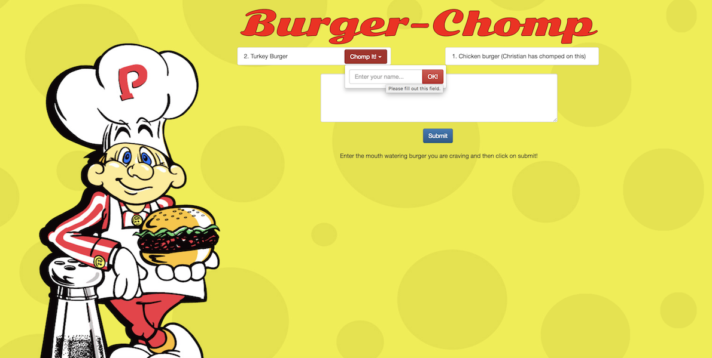

# sequelizeBurger



## What Is It?

Burger Chomp is a burger logger application created using MySQL, Node, Express, Handlebars and Sequelize.  This version contains the same functionality as the [Burger Chomp SQL](https://burger-chomp.herokuapp.com/) version, but with added functionality that allows entering the name of the customer that chomped on a particular burger.

## How Does It Work?

* Burger Chomp sequelize is a restaurant application that lets users input the names of burgers they'd like to eat and also assign their names to burgers they have eaten.

* Whenever a user submits a burger's name, the app will display the burger on the left side of the page -- waiting to be devoured.

* Each burger in the waiting area also has a `Chomp It!` button. When the user clicks on this button, they will be provided with the ability to enter their name, then the burger will be moved to the "chomped" side of the page.

* The application stores every burger in the database, whether devoured or not.

## How Do I Use It?

### Using Heroku

The application is hosted on Heroku and can be accessed by clicking on the following link [Burger Chomp](https://burger-chomp-seq.herokuapp.com/)

### On Your Local Machine

Execute the following steps to setup and run the application on your local machine.

1. Clone this repository to your machine and then run ```npm install```.
2. Launch the database GUI of your choice, i.e. Sequel Pro, and run the ```sequelizeBurger/db/schema.sql``` file.
3. Update the user and password in the ```burger/config/connection.js``` if necessary.
4. Run ```node server``` or ```nodemon server``` from the ```sequelizeBurger``` directory.
5. Point your browser to ```http://localhost:3000```

## Under The Hood

The application uses a MySQL database to store the burger data and Node.js as the backend.  Express is used as the application server, Handlebars as the web template system and Sequelize as the ORM.  Below is a list of all Node packages used:

* [express](https://www.npmjs.com/package/express)
* [method-override](https://www.npmjs.com/package/method-override)
* [body-parser](https://www.npmjs.com/package/body-parser)
* [path](https://nodejs.org/api/path.html)
* [sequelize](https://www.npmjs.com/package/sequelize)

## Error Handling

Empty burger names are not allowed.
